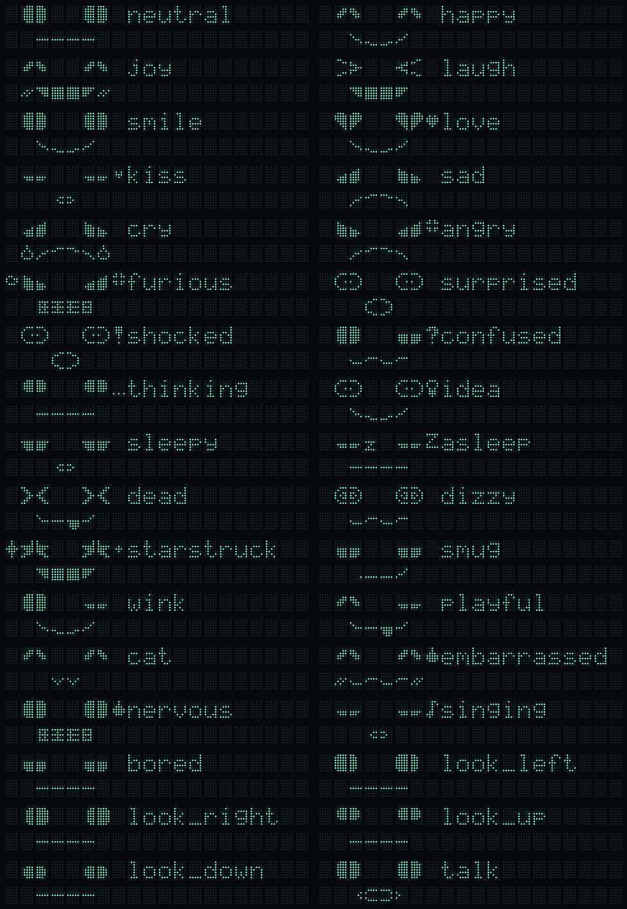
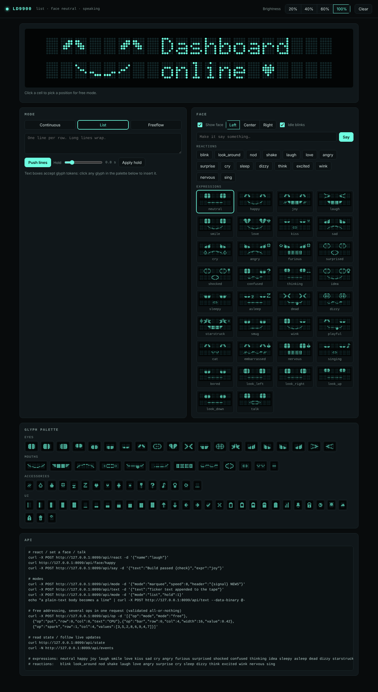

# ld9900

**Custom firmware, expressive faces and live streaming for Bematech / Logic Controls LD9900
USB VFD pole displays.**


The LD9900 is a 2×20 vacuum-fluorescent customer display of the kind found on POS terminals.
This project reverse-engineers its firmware update format, so you can:

- **Build your own firmware images** (`.c9f`) with a custom character set: 127 new glyphs for
  faces, icons and bar graphs. The standard A–Z / a–z / 0–9 / punctuation stay untouched.
- **Flash from Linux** over USB, with no vendor driver and no Windows tools.
- **Stream content** in three modes: a continuous ticker, line-by-line lists, and free addressing
  of all 40 cells.
- **Show faces**: 33 expressions, 16 animated reactions, talking with lip movement, and idle blinks.
- **Go ambient when idle**: the face moves aside and rotates clock, weather, news and your own cards.
- **Control it from anywhere**: a web dashboard, a REST API with live events, a Python client and
  a JSON socket.



> **Disclaimer.** This project is not affiliated with Bematech or Logic Controls. Flashing
> modified firmware may void your warranty. The tools only touch the application region, so the
> resident bootloader stays intact and the display can always be re-flashed with stock firmware
> (see [Recovery](#recovery)). Use at your own risk.

---

## Contents
- [Supported hardware](#supported-hardware)
- [Install](#install)
- [Quick start](#quick-start)
- [Building custom firmware (.c9f)](#building-custom-firmware-c9f)
- [Using the display](#using-the-display)
- [Ambient mode](#ambient-mode)
- [Dashboard and API](#dashboard-and-api)
- [Running as a service](#running-as-a-service)
- [How it works](#how-it-works)
- [Development](#development)

## Supported hardware

| | |
|---|---|
| Tested | Bematech **LD9900UP-GY-CM** (USB), firmware `LCI V1.45` |
| MCU | NXP/Freescale MC9S08JM32 (HCS08) |
| USB | VID `0x0FA8`, PID `A010` / `A030` / `A060` / `A090` (vendor class, bulk OUT EP2) |
| Likely compatible | Other Logic Controls LDX9000 / PDX3000 / LTX9000 / LDX1000 USB models that take `LCIGP_145.c9f`. Reports are welcome |

## Install

```sh
pip install ld9900                 # or, from a clone:  pip install .
pip install "ld9900[preview]"      # adds Pillow for PNG/GIF previews and font sheets
```

Linux needs `libusb-1.0` (it's preinstalled on most distros). To use the display without root:

```sh
sudo cp contrib/99-lcpd.rules /etc/udev/rules.d/
sudo udevadm control --reload      # then replug the display
ld9900 ctl info                    # should list the device and its endpoints
```

## Quick start

```sh
# 1. Build the custom firmware from the vendor's stock image (see below for where to get it)
ld9900 firmware build LCIGP_145.c9f            # -> FACES_145.c9f

# 2. Flash it (the boot screen then shows FACE01)
ld9900 ctl flash FACES_145.c9f

# 3. Make the custom glyph page the power-up default (one time)
ld9900 ctl raw 1B 27 08 00

# 4. Try everything
ld9900 stream demo                             # add --sim to preview in a terminal first
ld9900 dash                                    # dashboard on http://127.0.0.1:8099
```

---

## Building custom firmware (.c9f)

### Background
A `.c9f` "command set" file is a plain Motorola S19 image of the display's application
firmware. It isn't encrypted or signed. The vendor's download tool streams it to a bootloader
that lives in a protected part of flash and is never overwritten. The application image holds
**nine font tables** for character codes 0x80–0xFF (128 glyphs × 5×7 dots each). ASCII 0x20–0x7F
lives in the boot ROM and can't be changed this way.

`ld9900` patches those tables and a couple of well-understood bytes, re-emits the S19 with the
exact same record layout and valid checksums, and verifies the result by reading it back. Full
details are in [docs/firmware-notes.md](docs/firmware-notes.md).

### Step 1: Get the stock image
The firmware isn't redistributed here because it's Logic Controls' code. Download the
**"Line Display Command Set Utility"** package from the Bematech / Logic Controls support site
and take `Command Set Download/LCIGP_145.c9f` out of it.

```sh
ld9900 firmware info LCIGP_145.c9f
#   sha256  2b63561d8f515c42f591370458064e87ac946553065e37e0798492e1780abca2
#   known   stock LCIGP_145.c9f (Logic Controls LCIGP v1.45, dated 2016-03-01)
#   layout  LCIGP v1.45 (font selector at 0x8F37 verified)
```

The tools refuse any image that doesn't have the LCIGP v1.45 layout.

### Step 2: Choose how to build

#### A. The ld9900 glyph set (faces, icons, bars)
```sh
ld9900 firmware build LCIGP_145.c9f -o FACES_145.c9f
```
With default options the output is reproducible:
sha256 `a2fa3af1a226d7266c1b54cdc5c6b5e1a83c0c74dd0aa1943ab2999f6acf8daa`.

| Option | Default | Effect |
|---|---|---|
| `-o, --out FILE` | `FACES_145.c9f` | Output file |
| `--page N` | `8` | Which of the 9 font pages to replace (8 is the rarely used PC437+€ variant) |
| `--tag XXXXXX` | `FACE01` | 6-character string replacing `V 1.45` on the boot screen, so you can tell builds apart |
| `--no-tag` | | Keep `V 1.45` |
| `--no-normal-mode` | | Keep the stock power-up mode (Vertical Scroll) instead of Normal (addressable) |

#### B. Your own glyph set
All glyph art lives in [`src/ld9900/glyphs.py`](src/ld9900/glyphs.py) as ASCII pictures
(`#` = dot on). Multi-cell pieces are drawn as one picture and sliced into 5-pixel-wide cells
automatically:

```python
EYES["open"] = [            # 2 cells = 10 columns x 7 rows
    "..######..",
    ".########.",
    ".########.",
    ".########.",
    ".########.",
    ".########.",
    "..######..",
]
SINGLE["coffee"] = [".....", "#.#..", ".#.#.", "####.", "####.", ".##..", "....."]
```

Helpers: `mirror()`, `flip_v()`, and `from_fn(width, lambda x, y: ...)` for procedural shapes
(the bar-graph glyphs are generated this way). Rules:

- **At most 128 cells in total.** `ld9900 glyphs list` shows how they're allocated and how many are free.
- Every cell is exactly 7 rows × 5 columns.
- Adding or reordering glyphs shifts the codes after them. Clients that use `{name}` tokens are
  unaffected, but hard-coded byte values change.

Preview, then build:
```sh
ld9900 glyphs show coffee eye_open      # ASCII render in the terminal
ld9900 face preview previews/           # PNG of every expression + GIF of every reaction
ld9900 stream --sim face happy          # live terminal simulation
ld9900 firmware build LCIGP_145.c9f -o MINE_145.c9f --tag MINE01
```
The streamer, dashboard and simulator read the same `glyphs.py`, so they pick up your changes
automatically. Rebuild and re-flash only when the glyph art changes.

#### C. Edit any stock code page by hand
For tweaking the existing PC437, PC850 and other pages, work with plain-text page files:
```sh
ld9900 font extract LCIGP_145.c9f font/       # 9 editable pages + font_sheet.png
$EDITOR font/1_PC437.txt                       # each glyph: [0xNN] then 7 rows of 5 '#'/'.'
ld9900 font build LCIGP_145.c9f font/ EDITED_145.c9f --tag "ED 1.0" --normal-mode
ld9900 font render EDITED_145.c9f sheet.png    # visual check of all pages
```
Only pages whose file exists in `font/` are written, and unchanged glyphs are skipped.

### Step 3: Verify before flashing
```sh
ld9900 firmware info FACES_145.c9f             # layout, boot mode, tag, glyph match count
ld9900 font diff LCIGP_145.c9f FACES_145.c9f   # every changed address range
```
A correct build only differs in the font table (`0xBB8E–0xBE0D` for page 8), `0x8440` (boot
mode), and the 6-byte tag strings near `0xC600`.

To test a single glyph live before committing to a flash, use the stock firmware's one
temporary user glyph:
```sh
ld9900 ctl glyph "|" "#####/#...#/#.#.#/#...#/#.#.#/#...#/#####"   # then send "|"
```

### Step 4: Flash
**Linux** (tested; macOS should work via libusb but is untested)
```sh
ld9900 ctl flash FACES_145.c9f
```
This sends the bootloader handshake, waits for the erase, then streams the S19 one line every
50 ms. It takes about 30 s. If the display shows `DOWNLOADING FAILURE`, power-cycle it and retry
with more margin:
```sh
ld9900 ctl flash FACES_145.c9f --erase-wait 3 --line-delay 0.08
```

**Windows**: copy the `.c9f` next to the vendor's `DnLoadCSF.exe`. The tool lists every `*.C9F`
in its folder, so your build appears as its own entry. Unplug and replug the display, then download.

### Step 5: After flashing
```sh
ld9900 ctl raw 1B 27 08 00      # save font page 8 (+ US symbol set) as the power-up default
```
(`ld9900 stream` and `ld9900 dash` also select page 8 every time they start.)

### Recovery
The download only rewrites the application region. The bootloader also starts in download mode
at power-up, so a bad image can always be replaced:
```sh
ld9900 ctl flash LCIGP_145.c9f  # back to stock
```

### Safety checks the tools perform
- Refuse images whose font selector code (`0x8F37`) and table addresses don't match LCIGP v1.45.
- Only patch the mode byte if the surrounding instruction bytes are exactly as expected.
- Validate every S-record checksum on input, and recompute them on output with identical record layout.
- Read the written file back and compare every glyph before reporting success.
- Before flashing, `ctl flash` re-checks every record and asks for confirmation (`--yes` skips the prompt).

---

## Using the display

### Glyph tokens
Anywhere text is accepted, `{name}` inserts a custom glyph:
`"21{deg}C {sun}"`, `"build {check}"`, `"{heart} {batt3} {signal}"`.
Multi-cell pieces work too (`{mouth_smile}`), as do single cells (`{eye_open.0}`).
`ld9900 glyphs list` prints every name.

### Modes
```sh
ld9900 stream marquee --header "{signal} NEWS" --speed 8 "Ticker text scrolls in from the right"
tail -f /var/log/syslog | ld9900 stream --face list --hold 1     # face + newest lines
ld9900 stream free < ops.jsonl                                  # JSON ops (see API)
```
| Mode | Behaviour |
|---|---|
| `marquee` (continuous) | Text slides right-to-left one cell at a time; new input is appended to the tape; optional static header on the other row; `--loop` |
| `list` | Each new line pushes the previous one up; long lines word-wrap; `--hold` sets the minimum time per line |
| `free` | Draw text, bars and sparklines at any cell; the content persists and is repainted after speech or face moves |

### Faces
A face is 8×2 cells: two 2-cell eyes on the top row and a 4-cell mouth below, with accessory slots
(tears, blush, Zz, hearts, `!`, `?`, …). It can sit at any column, and the active mode uses the
remaining 12 columns.

```sh
ld9900 stream face happy --say "Hello!"
ld9900 stream react laugh
```
**Expressions:** neutral happy joy laugh smile love kiss sad cry angry furious surprised shocked
confused thinking idea sleepy asleep dead dizzy starstruck smug wink playful cat embarrassed
nervous singing bored look_left look_right look_up look_down talk
**Reactions:** blink look_around nod shake laugh love angry surprise cry sleep dizzy think excited
wink nervous sing


### Low-level control
```sh
ld9900 ctl normal | vscroll | clear | reset
ld9900 ctl put 1 5 "text"         ld9900 ctl pos 20      ld9900 ctl bright 2
ld9900 ctl font 8                  ld9900 ctl raw 1B 25 08
```

## Ambient mode

When nothing has been sent for a while, the display goes ambient. The face slides to the right
edge, and the left 12 columns rotate through info cards. The face's mood follows the content: it
smiles at clear skies, sweats above 100 °F, and sleeps during quiet hours (when the display also
dims). The first real command restores the exact previous screen, including the mode, free-mode
drawings, list history and the face's position and expression.

| Card | Source |
|---|---|
| `clock` | Local date and time, updated live |
| `weather` | [Open-Meteo](https://open-meteo.com) (free, no API key): temperature, conditions, high/low, humidity, wind |
| `news` | Any RSS 2.0 / Atom feeds. Long headlines scroll |
| `facts` | Your own list or a text file |
| `system` | Hostname, uptime, load |
| `pushed` | Cards that other services send with the `card` op, with an expiry |

```sh
ld9900 ambient init                    # writes ~/.config/ld9900/ambient.json; set lat/lon + feeds
ld9900 ambient test                    # fetch every source once and print the cards
ld9900 ambient preview --sim           # watch it in the terminal right away
ld9900 dash --ambient                  # dashboard + ambient after `idle_after` seconds
ld9900 dash --ambient --idle-after 30
```

Push cards from other systems. Cards are passive, so they never wake the display:
```sh
curl -X POST localhost:8099/api/card -d '{"id":"garage","title":"{home}Garage","text":"Door open {warn}","mood":"nervous","ttl":900}'
curl -X POST localhost:8099/api/card -d '{"id":"garage","text":""}'     # remove it
```
```python
ld.op("card", id="build", title="{check}CI", text="main passed in 4m12s", mood="happy", ttl=3600)
```
The dashboard has an Ambient panel with enable/disable, idle time, "Show now"/"Exit", a push
box, and live previews of every card in the rotation. See
[`examples/ambient.json`](examples/ambient.json) for every config option.

## Dashboard and API

```sh
ld9900 dash                                          # http://127.0.0.1:8099
ld9900 dash --host 0.0.0.0 --token SECRET --face     # LAN; open http://HOST:8099/?token=SECRET
ld9900 dash --sim                                    # no hardware
```



The dashboard has a live preview (click a cell to target free mode), mode tabs, face controls,
an expression grid, reaction buttons, brightness, and a glyph palette that inserts tokens.

**REST:** `POST /api/<op>`, `GET /api/<op>/<value>`, batches via `POST /api/op`, plus
`/api/state`, `/api/meta` and live `/api/events` (SSE). Every request is validated; bad input gets
a 400 with a reason. See [docs/api.md](docs/api.md).

```sh
curl -X POST localhost:8099/api/say -d '{"text":"Deploy done {check}","expr":"joy"}'
curl localhost:8099/api/react/excited
```

**Python:**
```python
from ld9900.client import LD
ld = LD("http://display:8099", token="SECRET")
ld.react("love")
with ld.batch() as b:
    b.mode("free"); b.put(0, 8, "GPU"); b.bar(0, 12, 0.73, width=8)
```
**CLI:** `ld9900 client react name=love`.
**Examples:** [`examples/system_monitor.py`](examples/system_monitor.py) (CPU sparkline and
memory bar, with a face that reacts to load) and [`examples/notify.sh`](examples/notify.sh)
(CI and cron hooks).

## Running as a service
```sh
sudo cp contrib/ld9900-dash.service /etc/systemd/system/
sudo systemctl edit ld9900-dash        # set User= and replace CHANGE_ME with a token
sudo systemctl enable --now ld9900-dash
```

## How it works
- The application image calls into the resident boot block through a small jump table
  (`$FE00–$FE0C`). The app fills a 40-byte RAM buffer of character codes and a pointer to the
  active 0x80–0xFF font table, and the resident code drives the VFD.
- A hidden prefix `1B 1F 1E 13 0C` exposes service functions. `… 18` jumps to the bootloader,
  which then accepts `Logic Controls, Inc` followed by S-record lines.
- Updates are diffed: only changed cells are sent (`10 pos` + bytes). A talking face averages
  roughly 70 bytes/s.

Memory map, RAM interface, protocols and command reference: [docs/firmware-notes.md](docs/firmware-notes.md).

## Development
```sh
pip install -e ".[test]"
pytest -q
```
The tests never need the vendor firmware. They build a synthetic S19 with the same layout
markers, check every patch and checksum, and replay all USB traffic through a model of the
firmware's display writer to confirm the screen always matches what was intended.

```
src/ld9900/
  cli.py        ld9900 command
  firmware.py   build / inspect .c9f images
  fontfile.py   S19 + font-table codec, page text format
  glyphs.py     custom glyph art + names (single source of truth)
  face.py       expressions, reactions, talking
  ambient.py    idle mode: card providers (clock, weather, news, facts, system, pushed)
  stream.py     framebuffer, modes, face layer, socket server
  dash.py       web dashboard + REST/SSE API
  client.py     Python client
  ctl.py        USB transport, low-level commands, flasher
  sim.py        VFD simulator (PNG / terminal)
```

## License
MIT. See [LICENSE](LICENSE). Vendor firmware and tools remain the property of their owners
and are not included.
